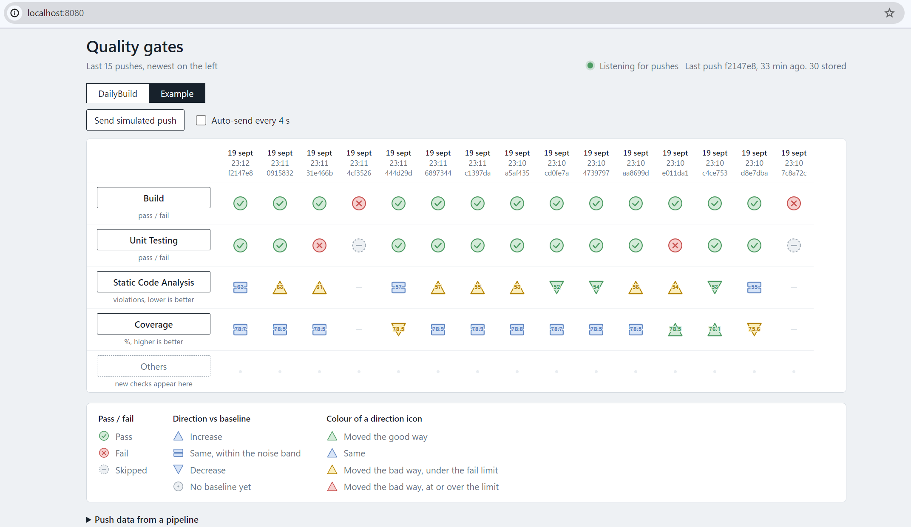

# Quality Gate Dashboard

A standard-library Python dashboard for monitoring CI quality gates across
workflows. Pipeline results are accepted through an HTTP API, processed by a
background worker, stored in SQLite, and pushed to the browser through
Server-Sent Events.

## Contents

- [Start](#start)
- [GitHub Actions Integration](#github-actions-integration)
- [Multiple Checks and Workflows](#multiple-checks-and-workflows)
- [Main Documentation](#main-documentation)
- [Project Shape](#project-shape)

## Start

From the repository root:

```text
python Dashboard.py
```

Open <http://127.0.0.1:8080>.

Useful options:

```text
python Dashboard.py --port 9000
python Dashboard.py --db :memory: --no-seed
python Dashboard.py --reset
```

## Snapshot



The dashboard presents a live matrix of workflow runs and checks. Each column is a recent pipeline run, and each row is a quality gate such as build, unit tests, coverage, or memory usage.

```text
Quality gates                                      Live

DailyBuild
┌────────────────────────────────────────────────────────────────────────────┐
│ Check         │ 09:42 │ 09:05 │ 08:31 │ 07:58 │ 07:20 │ 06:55 │ 06:12 │
├────────────────────────────────────────────────────────────────────────────┤
│ build         │   ✓   │   ✓   │   ✓   │   ✓   │   ✓   │   ✗   │   ✓   │
│ unit_test     │   ✓   │   ✓   │   ✗   │   ✓   │   ✓   │   ✓   │   ✓   │
│ coverage      │  ▲84.7│  ▲83.9│  ▲82.4│  ▲81.2│  ▲80.6│  ▲79.8│  ▲78.9│
│ static_analysis│   12  │   13  │   18  │   21  │   26  │   31  │   34  │
│ flash_usage   │  ▼412.5KB │ ▼420.0KB │ ▼432.8KB │ ▼440.1KB │ ▼448.7KB │ ... │
└────────────────────────────────────────────────────────────────────────────┘
```

The UI uses a simple visual language:

- Green check marks mean the gate passed.
- Red X marks mean the gate failed.
- Up/down arrows show trend direction for numeric checks.
- The newest run is shown on the left, while older results move to the right.
- The status indicator at the top shows whether the dashboard is receiving live updates.

## How it operates

```text
GitHub Actions / CI job
        │
        │ POST JSON to /api/ingest
        ▼
Quality Gate Dashboard
        │
        ├─ validate payload and check metadata
        ├─ queue request in the background worker
        ├─ store latest results in SQLite
        ├─ compare trend values to previous run or baseline
        └─ push updates to the browser over Server-Sent Events (SSE)
                        │
                        ▼
                Browser refreshes the dashboard grid
```

In practice, a pipeline posts a JSON payload with one or more checks. The backend accepts the data, updates the workflow history, and automatically registers new check names. The frontend listens for new events and updates the dashboard without reloading the page.

## GitHub Actions Integration

A GitHub Actions job can push its results to `POST /api/ingest` after the
quality checks finish. Store the dashboard base URL in a repository or
organization secret named `QUALITY_DASHBOARD_URL`, for example:

```text
https://quality-dashboard.example.com
```

The dashboard must be reachable from the GitHub Actions runner. A hosted
GitHub runner cannot reach `127.0.0.1` on your workstation or lab server. Use
a reachable internal URL with a self-hosted runner, or expose the dashboard
through an appropriately secured endpoint. Do not put credentials directly in
the workflow file; add authentication separately if the dashboard is exposed
outside a trusted network.

Example workflow step:

```yaml
name: CI quality gates

on:
  push:
    branches: [main, develop]

jobs:
  quality:
    runs-on: ubuntu-latest
    steps:
      - uses: actions/checkout@v4

      - name: Run build and tests
        id: checks
        run: |
          set -o pipefail
          ./build.sh
          ./run-tests.sh

      - name: Publish results to Quality Gate Dashboard
        if: always()
        env:
          DASHBOARD_URL: ${{ secrets.QUALITY_DASHBOARD_URL }}
          BUILD_RESULT: ${{ steps.checks.outcome }}
          COMMIT_SHA: ${{ github.sha }}
          BRANCH_NAME: ${{ github.ref_name }}
          RUN_ID: ${{ github.run_id }}
        run: |
          if [ "$BUILD_RESULT" = "success" ]; then
            BUILD_STATUS=pass
          else
            BUILD_STATUS=fail
          fi

          curl --fail-with-body --silent --show-error \
            --request POST "$DASHBOARD_URL/api/ingest" \
            --header "Content-Type: application/json" \
            --data "{\
              \"workflow\": \"GitHub Actions\",\
              \"commit\": \"$COMMIT_SHA\",\
              \"branch\": \"$BRANCH_NAME\",\
              \"run_id\": \"$RUN_ID\",\
              \"results\": [\
                {\"check\": \"build\", \"status\": \"$BUILD_STATUS\"}\
              ]\
            }"
```

The publishing step uses `if: always()` so failed builds are reported as
`fail` instead of disappearing from the dashboard. Add more entries to the
`results` array for unit tests, static analysis, coverage, or other checks:

```json
{
  "check": "coverage",
  "type": "trend",
  "value": 82.4,
  "unit": "%",
  "polarity": "higher_is_better",
  "tolerance": 0.3,
  "fail_delta": 2
}
```

For a trend check, send a `baseline` when the pipeline owns the comparison;
otherwise the dashboard compares the value with the previous run in the same
workflow. The API returns HTTP `202` when the result is accepted into the
dashboard queue.

## Multiple Checks and Workflows

Send all checks from one pipeline execution in the same `results` array. The
dashboard supports pass/fail checks and numeric trend checks in one request:

```bash
curl --fail-with-body --silent --show-error \
  --request POST "$DASHBOARD_URL/api/ingest" \
  --header "Content-Type: application/json" \
  --data '{
    "workflow": "DailyBuild",
    "commit": "a1b2c3d",
    "replace_existing_commit": true,
    "branch": "develop",
    "run_id": "github-123456",
    "results": [
      {"check": "build", "status": "pass"},
      {"check": "unit_test", "status": "pass"},
      {"check": "static_analysis", "value": 12},
      {"check": "coverage", "value": 84.7},
      {
        "check": "flash_usage",
        "type": "trend",
        "value": 412.5,
        "unit": "KB",
        "polarity": "lower_is_better",
        "tolerance": 0.5,
        "fail_delta": 8,
        "label": "Flash usage"
      }
    ]
  }'

    Set `replace_existing_commit` to `true` to replace an earlier run with the same
    commit in the same workflow. This is useful for runner retries: the retried
    results replace the earlier values instead of adding a duplicate trend point.
    The option is `false` by default.
```

Use a different `workflow` value for each independent pipeline. For example,
the same dashboard can receive separate pushes for `DailyBuild` and
`NightlyRegression`:

```json
{
  "workflow": "NightlyRegression",
  "commit": "f9e8d7c",
  "branch": "main",
  "run_id": "github-987654",
  "results": [
    {"check": "build", "status": "pass"},
    {"check": "unit_test", "status": "pass"},
    {"check": "integration_test", "status": "pass"},
    {"check": "coverage", "value": 86.1, "baseline": 85.5}
  ]
}
```

Trend baselines are isolated by workflow. A `coverage` value from
`NightlyRegression` is compared with the previous `NightlyRegression` value,
not with the latest `DailyBuild` value. New check names are registered
automatically; their optional configuration is applied on the first push.

## Main Documentation

Read the [Project Guide](docs/PROJECT_GUIDE.md) for the current project
structure, API payloads, database behavior, development rules, and instructions
for adding new checks.

Architecture planning is documented in:

- [Architecture Proposal](docs/ArchDesign/ARCHITECTURE_PROPOSAL.md)
- [UML Design Plan](docs/ArchDesign/UML_DESIGN_PLAN.md)

## Project Shape

- `Dashboard.py` is only the application entry point.
- `src/backend/domain` contains models, policies, validation, and ports.
- `src/backend/application` contains use cases and the background worker.
- `src/backend/infrastructure` contains SQLite, queue, event, and clock adapters.
- `src/backend/interfaces` contains HTTP, presentation, and frontend adapters.
- `src/frontend/index.html` contains the dashboard UI.
- `tools/` contains testing utilities and is outside the application architecture.

The project intentionally uses Python's standard library only.
