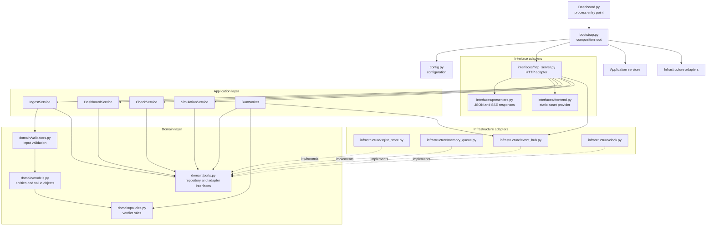
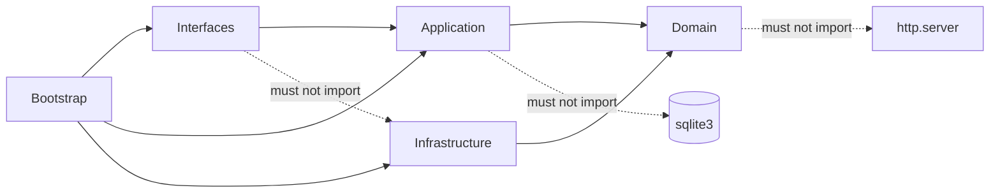
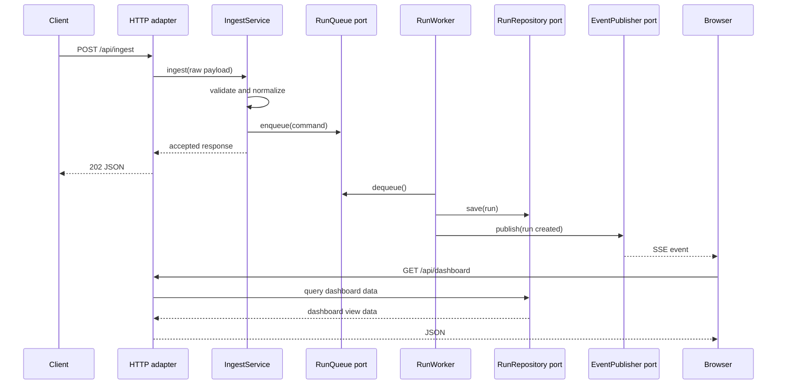

# Quality Gate Dashboard Architecture Proposal

> Baseline architecture. The layered refactor described here is now implemented
> in `src/backend`; future changes should preserve these boundaries.

## Goals

- Make each class and module responsible for one reason to change.
- Keep domain rules testable without starting an HTTP server or SQLite database.
- Keep the HTTP API stable while replacing the current monolithic backend.
- Make infrastructure replaceable, especially SQLite, the in-memory queue, and SSE.
- Preserve the standard-library-only runtime constraint.

## Original Responsibilities

Before the refactor, `src/backend/server.py` contained all of these concerns:

- Domain rules: trend verdicts, timestamps, and payload validation.
- Persistence: SQLite schema, check registration, run history, and queries.
- Application workflows: ingest, simulation, seeding, and queue processing.
- Delivery: HTTP routing, JSON encoding, and SSE subscriptions.
- Composition: configuration, database creation, worker startup, and server startup.
- Frontend asset loading.

Those responsibilities are now separated across the domain, application,
infrastructure, and interfaces packages without changing endpoint behavior.

## Proposed Structure

```text
Dashboard.py                         # Thin process entry point only
src/
  backend/
    __init__.py
    bootstrap.py                      # Composition root: build and start the app
    config.py                         # CLI/environment configuration

    domain/
      __init__.py
      models.py                       # Check, Run, Result, configuration value objects
      policies.py                     # Trend verdict policy and status normalization
      validators.py                   # Domain-level payload validation
      ports.py                        # Interfaces for persistence, queue, and events

    application/
      __init__.py
      ingest_service.py               # Validate and enqueue an incoming run
      dashboard_service.py            # Build dashboard view data
      check_service.py                # Create and update check definitions
      simulation_service.py           # Generate demo runs
      worker.py                       # Consume jobs and publish outcomes

    infrastructure/
      __init__.py
      sqlite_store.py                 # SQLite implementation of repository ports
      memory_queue.py                 # Queue implementation
      event_hub.py                    # In-process event publisher/subscriber
      clock.py                        # UTC clock implementation

    interfaces/
      __init__.py
      http_server.py                  # HTTP server adapter and request dispatch
      presenters.py                   # JSON/SSE response formatting
      frontend.py                     # Static frontend asset provider

  frontend/
    index.html
    app.js                            # Future optional browser behavior split
    styles.css                        # Future optional stylesheet split
```

## Mermaid Overview



## Dependency Direction



The arrows represent allowed dependencies. Infrastructure implements ports
owned by the domain/application boundary; it is selected in `bootstrap.py`.

## SOLID Mapping

### Single Responsibility Principle

- `SqliteStore` owns SQLite persistence only.
- `IngestService` owns the ingest use case only.
- `HttpServer` translates HTTP requests and responses only.
- `TrendPolicy` owns trend verdict decisions only.
- `FrontendProvider` reads the static frontend asset only.

### Open/Closed Principle

New persistence, queue, or event implementations can be added behind ports
without changing domain services. For example, a file-backed queue or a
network event broker could replace the in-memory implementations later.

### Liskov Substitution Principle

Every adapter must honor the behavior defined by its port. A test fake for
`RunRepository` should be usable anywhere `SqliteStore` is used without
changing service behavior.

### Interface Segregation Principle

Avoid one large `Store` interface. Prefer focused ports such as:

- `CheckRepository`
- `RunRepository`
- `RunQueue`
- `EventPublisher`
- `Clock`

Services receive only the port methods they need.

### Dependency Inversion Principle

Application services depend on ports, not concrete SQLite connections, queues,
HTTP handlers, or global variables. `bootstrap.py` supplies concrete adapters.

## Proposed Request Flow



## Refactor Status and Future Phases

1. **Completed: extract domain primitives**: models, validation, and policies
  live under `src/backend/domain`.
2. **Completed: introduce ports and adapters**: repository, queue, event, and
  clock protocols are implemented by infrastructure adapters.
3. **Completed: extract application services**: ingest, dashboard, checks,
  simulation, and worker workflows are independent of HTTP.
4. **Completed: extract HTTP adapters**: routing and serialization live under
  `src/backend/interfaces`.
5. **Completed: create the composition root**: `bootstrap.py` builds the
  application and `Dashboard.py` delegates to it.
6. **Future: split frontend assets**: extract JavaScript and CSS from
  `index.html` if browser code grows enough to justify separate files.
7. **Future: remove compatibility wrapper**: remove `server.py` only after
  downstream imports no longer depend on it.

## Review Decisions Needed

- Should the public API remain based on `BaseHTTPRequestHandler`, or should a
  small framework be introduced later?
- Should the worker remain in-process, or should queue processing become a
  separate process in a later phase?
- Should domain objects be immutable dataclasses, or should plain dictionaries
  remain at the HTTP boundary only?
- Is the standard-library-only constraint permanent?
