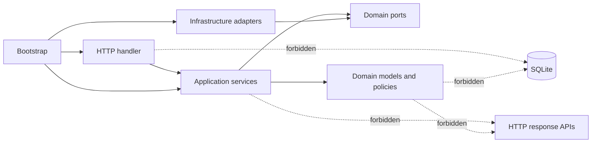

# Quality Gate Dashboard UML Design Plan

> Planning document only. This defines the proposed code connections before the
> OOP/SOLID refactor is implemented.

## Purpose

This document translates the architecture proposal into classes, interfaces,
and code ownership. The first implementation should preserve the existing HTTP
contract while replacing the current `server.py` responsibilities with focused
objects.

## Package-to-Class Map

| Package | Planned type | Responsibility |
| --- | --- | --- |
| `domain.models` | `CheckDefinition` | Immutable check configuration and metadata. |
| `domain.models` | `Run` | A workflow execution and its results. |
| `domain.models` | `CheckResult` | Pass/fail or trend result for one check. |
| `domain.models` | `TrendVerdict` | Direction and severity value object. |
| `domain.policies` | `TrendPolicy` | Calculates direction and severity from a delta. |
| `domain.policies` | `StatusPolicy` | Normalizes external status aliases. |
| `domain.validators` | `PayloadValidator` | Converts raw JSON dictionaries into validated commands. |
| `domain.ports` | `CheckRepository` | Contract for reading and updating checks. |
| `domain.ports` | `RunRepository` | Contract for saving and querying runs. |
| `domain.ports` | `RunQueue` | Contract for enqueueing and consuming ingest commands. |
| `domain.ports` | `EventPublisher` | Contract for publishing dashboard events. |
| `domain.ports` | `Clock` | Contract for obtaining UTC timestamps. |
| `application.ingest_service` | `IngestService` | Validates input and queues an ingest command. |
| `application.dashboard_service` | `DashboardService` | Returns dashboard data for a workflow. |
| `application.check_service` | `CheckService` | Creates and updates check definitions. |
| `application.simulation_service` | `SimulationService` | Builds demo payloads and queues them. |
| `application.worker` | `RunWorker` | Persists queued commands and publishes events. |
| `infrastructure.sqlite_store` | `SqliteCheckRepository` | SQLite implementation of `CheckRepository`. |
| `infrastructure.sqlite_store` | `SqliteRunRepository` | SQLite implementation of `RunRepository`. |
| `infrastructure.memory_queue` | `MemoryRunQueue` | Thread-safe in-process queue adapter. |
| `infrastructure.event_hub` | `SseEventPublisher` | In-process subscriber fan-out for SSE. |
| `infrastructure.clock` | `SystemClock` | Production UTC clock. |
| `interfaces.http_server` | `DashboardHttpHandler` | Translates HTTP requests into service calls. |
| `interfaces.presenters` | `JsonPresenter` | Serializes API responses. |
| `interfaces.presenters` | `SsePresenter` | Formats event-stream messages. |
| `interfaces.frontend` | `FrontendProvider` | Loads the static frontend file. |
| `bootstrap` | `Application` | Owns object construction and server lifecycle. |

## UML Class Diagram

```mermaid
classDiagram
    direction TB

    class CheckDefinition {
        +name: str
        +label: str
        +kind: CheckKind
        +polarity: Polarity
        +unit: str
        +tolerance: float
        +fail_delta: float
    }
    class Run {
        +id: int
        +workflow: str
        +commit: str
        +branch: str
        +timestamp: datetime
        +results: list~CheckResult~
    }
    class CheckResult {
        +check_name: str
        +status: str
        +value: float
        +baseline: float
        +delta: float
        +verdict: TrendVerdict
    }
    class TrendVerdict {
        +direction: str
        +severity: str
    }
    class TrendPolicy {
        +judge(check, delta) TrendVerdict
    }
    class StatusPolicy {
        +normalize(status) str
    }
    class PayloadValidator {
        +validate(payload, known_checks) IngestCommand
    }

    class IngestService {
        +ingest(payload) EnqueueResult
    }
    class DashboardService {
        +get_dashboard(limit, workflow) DashboardView
    }
    class CheckService {
        +upsert_check(command) CheckDefinition
    }
    class SimulationService {
        +simulate(workflow) EnqueueResult
    }
    class RunWorker {
        +run_forever() None
        +process(command) int
    }

    class CheckRepository {
        <<interface>>
        +list_checks() list
        +get(name) CheckDefinition
        +save(check) CheckDefinition
        +kinds() dict
    }
    class RunRepository {
        <<interface>>
        +save(run) int
        +dashboard(limit, workflow) DashboardView
        +last_values(workflow) dict
        +count(workflow) int
    }
    class RunQueue {
        <<interface>>
        +put(command) None
        +get() IngestCommand
        +task_done() None
    }
    class EventPublisher {
        <<interface>>
        +publish(event) None
        +subscribe() EventSubscription
    }
    class Clock {
        <<interface>>
        +now() datetime
    }

    class SqliteCheckRepository
    class SqliteRunRepository
    class MemoryRunQueue
    class SseEventPublisher
    class SystemClock
    class DashboardHttpHandler
    class FrontendProvider
    class Application

    Run *-- CheckResult
    CheckResult *-- TrendVerdict
    TrendPolicy --> CheckDefinition
    PayloadValidator --> CheckDefinition
    PayloadValidator --> CheckResult

    IngestService --> PayloadValidator
    IngestService --> CheckRepository
    IngestService --> RunQueue
    DashboardService --> CheckRepository
    DashboardService --> RunRepository
    CheckService --> CheckRepository
    SimulationService --> RunRepository
    SimulationService --> RunQueue
    RunWorker --> RunQueue
    RunWorker --> RunRepository
    RunWorker --> EventPublisher
    RunWorker --> TrendPolicy
    RunWorker --> Clock

    SqliteCheckRepository ..|> CheckRepository
    SqliteRunRepository ..|> RunRepository
    MemoryRunQueue ..|> RunQueue
    SseEventPublisher ..|> EventPublisher
    SystemClock ..|> Clock

    DashboardHttpHandler --> IngestService
    DashboardHttpHandler --> DashboardService
    DashboardHttpHandler --> CheckService
    DashboardHttpHandler --> SimulationService
    DashboardHttpHandler --> EventPublisher
    DashboardHttpHandler --> FrontendProvider
    Application --> DashboardHttpHandler
    Application --> RunWorker
    Application --> SqliteCheckRepository
    Application --> SqliteRunRepository
    Application --> MemoryRunQueue
    Application --> SseEventPublisher
    Application --> SystemClock
```



## Code Connection Plan

### 1. `Dashboard.py` and `bootstrap.py`

`Dashboard.py` remains a process entry point only:

```python
from src.backend.bootstrap import main

if __name__ == "__main__":
    main()
```

`bootstrap.main()` should parse configuration, construct `Application`, and
start the HTTP server. No repository, queue, or handler construction should
occur in `Dashboard.py`.

### 2. Domain Models and Policies

`domain.models` contains dataclasses or small immutable value objects. These
objects must not import `sqlite3`, `http.server`, or application services.

`TrendPolicy` receives a `CheckDefinition` and a numeric delta, then returns a
`TrendVerdict`. The existing `judge()` behavior moves here without changing
its output rules.

`PayloadValidator` owns boundary validation and returns a typed `IngestCommand`.
It may use domain policies, but it must not enqueue or persist anything.

### 3. Repository Ports and SQLite Adapters

The application layer sees only focused repository interfaces:

```python
class RunRepository(Protocol):
    def save(self, run: Run) -> int: ...
    def dashboard(self, limit: int, workflow: str) -> DashboardView: ...
    def last_values(self, workflow: str) -> dict[str, float]: ...
```

`SqliteRunRepository` owns connection setup, schema creation, SQL statements,
row mapping, retention cleanup, and transaction boundaries. It must not know
about HTTP status codes or SSE formatting.

The current `Store` should be split into check and run repository behavior.
During migration, both adapters may share a private SQLite session helper, but
that helper must not become a new global service locator.

### 4. Application Services

Services coordinate one user-facing workflow and receive dependencies through
constructors:

```python
class IngestService:
    def __init__(self, validator, checks, queue): ...

    def ingest(self, raw_payload):
        command = self.validator.validate(raw_payload, self.checks.kinds())
        self.queue.put(command)
        return EnqueueResult(...)
```

They should return typed results or view models. They should not write HTTP
responses, inspect request headers, or call `send_response()`.

### 5. Worker and Event Flow

`RunWorker` owns the background processing loop. It receives a queue, run
repository, event publisher, trend policy, and clock. For every command it:

1. Converts the validated command into a `Run`.
2. Resolves baselines through the run repository.
3. Calculates trend verdicts through `TrendPolicy`.
4. Saves the run.
5. Publishes a `run` event.
6. Marks the queue task complete even when processing fails.

The worker must not depend on `BaseHTTPRequestHandler`.

### 6. HTTP Interface

`DashboardHttpHandler` remains a thin adapter around the standard-library HTTP
server. Its job is limited to:

- Parse URL paths and query values.
- Read and decode JSON request bodies.
- Call an application service.
- Convert the service result into JSON or SSE output.
- Map expected validation errors to HTTP 400 responses.

It should not contain SQL, trend calculations, queue management, or frontend
business logic.

### 7. Frontend Provider

`FrontendProvider` loads `src/frontend/index.html` and returns bytes. The HTTP
adapter asks it for the response body for `/` and `/index.html`. This keeps
filesystem concerns outside the request handler while retaining the current
static frontend behavior.

## Dependency Rules



Allowed dependencies point toward abstractions and domain rules. Concrete
infrastructure is selected only in the composition root.

## Planned Test Seams

| Test target | Test doubles | Main assertions |
| --- | --- | --- |
| `TrendPolicy` | None | Direction, tolerance, warning, and failure decisions. |
| `PayloadValidator` | Fake check catalog | Invalid payloads and normalized commands. |
| `IngestService` | Fake validator, checks, queue | One validated command is queued. |
| `RunWorker` | Fake queue, repository, clock, publisher | Save and publish order; task completion on errors. |
| `DashboardService` | Fake repositories | Correct workflow and result view. |
| `DashboardHttpHandler` | Fake services | Routes, status codes, and response shapes. |
| SQLite repositories | Temporary SQLite database | Schema, retention, baseline, and query behavior. |

## Implementation Order

1. Add domain models and policies with tests copied from current behavior.
2. Define ports and create SQLite adapters around the existing SQL behavior.
3. Extract `IngestService`, `DashboardService`, and `CheckService`.
4. Extract `RunWorker`, simulation, and event publishing.
5. Reduce the HTTP handler to routing and serialization.
6. Add `bootstrap.py` and make `Dashboard.py` delegate to it.
7. Run API and browser smoke tests, then remove obsolete code.

No module split should be accepted if it changes the existing API payloads,
status codes, workflow filtering, retention behavior, or SSE event names.
