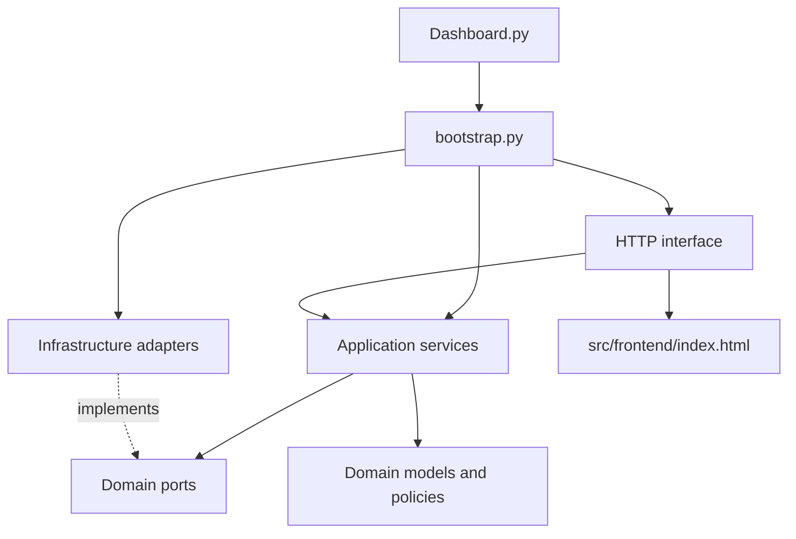

# Quality Gate Dashboard Project Guide

This is the main reference for the current project. It explains how the
application is organized, how to run it, how pipeline data enters the system,
and how to add or configure quality checks.

## Quick Start

From the repository root:

```text
python Dashboard.py
```

Open <http://127.0.0.1:8080>.

Useful options:

```text
python Dashboard.py --port 9000
python Dashboard.py --host 0.0.0.0
python Dashboard.py --db :memory: --no-seed
python Dashboard.py --reset
```

The default database is `ci_dashboard.db` in the repository root. A new empty
database receives demo data unless `--no-seed` is supplied.

## Project Structure

```text
Dashboard.py                         # Only the process entry point
README.md                            # Short project overview
src/
  backend/
    bootstrap.py                      # Composition root and server lifecycle
    config.py                         # CLI argument parsing and Config
    server.py                         # Compatibility wrapper
    domain/
      models.py                       # Domain entities and value objects
      policies.py                     # Trend and status policies
      ports.py                        # Protocol interfaces for dependencies
      validators.py                   # Ingest payload validation
    application/
      ingest_service.py               # POST /api/ingest use case
      dashboard_service.py            # Dashboard query use case
      check_service.py                # Check configuration use case
      simulation_service.py           # Demo run generation
      worker.py                       # Asynchronous queue consumer
    infrastructure/
      sqlite_store.py                 # SQLite persistence adapter
      memory_queue.py                 # In-process queue adapter
      event_hub.py                    # SSE event fan-out
      clock.py                        # UTC clock adapter
    interfaces/
      http_server.py                  # HTTP routing and request parsing
      presenters.py                   # JSON and SSE serialization
      frontend.py                     # Static frontend file provider
  frontend/
    index.html                        # Browser dashboard

docs/
  PROJECT_GUIDE.md                    # This document
  ArchDesign/
    ARCHITECTURE_PROPOSAL.md          # Layered architecture proposal
    UML_DESIGN_PLAN.md                # Classes, ports, and connections

tools/
  example_payload.json                # Test payload data
  post_data.py                        # Testing utility; outside application code
```

The `tools/` directory is intentionally excluded from the application
architecture. It contains utilities for testing and manual integration.

## Runtime Architecture

`Dashboard.py` delegates to `src.backend.bootstrap.main`. The composition root
constructs concrete infrastructure adapters and injects them into application
services. HTTP handlers depend on those services, not directly on SQLite or
queue internals.



The detailed design is in [ArchDesign/ARCHITECTURE_PROPOSAL.md](ArchDesign/ARCHITECTURE_PROPOSAL.md) and [ArchDesign/UML_DESIGN_PLAN.md](ArchDesign/UML_DESIGN_PLAN.md).

The root [README](../README.md) includes a complete GitHub Actions example for
posting results to `/api/ingest`, including runner networking requirements and
the `if: always()` publishing pattern.

## Data Flow

1. A pipeline sends JSON to `POST /api/ingest`.
2. `PayloadValidator` validates names, statuses, timestamps, values, and check kinds.
3. `IngestService` places an immutable `IngestCommand` on `MemoryRunQueue`.
4. `RunWorker` consumes the command in a daemon thread.
5. `SqliteStore` resolves trend baselines, calculates verdicts through `TrendPolicy`, and stores the run.
6. `SseEventPublisher` tells connected browsers that a run is available.
7. The browser requests `/api/dashboard` and redraws the board.

## Ingest API

Endpoint:

```text
POST http://127.0.0.1:8080/api/ingest
Content-Type: application/json
```

Example:

```json
{
  "workflow": "DailyBuild",
  "commit": "a1b2c3d",
  "replace_existing_commit": false,
  "branch": "develop",
  "run_id": "gha-123456",
  "results": [
    {"check": "build", "status": "pass"},
    {"check": "unit_test", "status": "fail"},
    {"check": "static_analysis", "value": 41},
    {"check": "coverage", "value": 78.4, "baseline": 77.9}
  ]
}
```

A successful request returns HTTP `202` and queues the run. Status aliases
include `pass`, `passed`, `success`, `ok`, `fail`, `failed`, `failure`,
`error`, `skip`, `skipped`, `cancelled`, and `canceled`.
Set `replace_existing_commit` to `true` to replace an earlier run with the same
commit in the same workflow. It defaults to `false`.

### Pass/Fail Checks

Use a `status` field:

```json
{"check": "build", "status": "pass"}
```

Supported normalized statuses are `pass`, `fail`, and `skip`.

### Trend Checks

Use `value`, optionally with `baseline` or `delta`:

```json
{"check": "coverage", "value": 82.1}
{"check": "coverage", "value": 82.1, "baseline": 80.0}
{"check": "static_analysis", "delta": -3}
```

If no baseline is supplied, the previous value for the same check and workflow
is used. If no previous value exists, the result has no comparison baseline.

Trend configuration can be supplied when a check first appears:

```json
{
  "check": "flash_usage",
  "type": "trend",
  "value": 412.5,
  "unit": "KB",
  "polarity": "lower_is_better",
  "tolerance": 0.5,
  "fail_delta": 8,
  "label": "Flash usage"
}
```

- `higher_is_better`: a positive delta is good.
- `lower_is_better`: a negative delta is good.
- `tolerance`: changes within this absolute amount are neutral.
- `fail_delta`: a bad change at or above this amount is bad; smaller bad changes are warnings.

## Adding New Checkers

There are two meanings of “new checker” in the current system.

### Add a New Check Definition

For a check whose result is already produced by a pipeline, no Python code is
needed. Send the check name in an ingest payload. Unknown checks are registered
automatically using the supplied `type` and optional configuration.

You can also configure a check explicitly:

```text
POST /api/checks
Content-Type: application/json
```

```json
{
  "name": "lint_errors",
  "kind": "trend",
  "label": "Lint errors",
  "unit": "errors",
  "polarity": "lower_is_better",
  "tolerance": 0,
  "fail_delta": 3
}
```

Valid check names contain 1 to 40 letters, digits, underscores, dots, or
hyphens. Valid kinds are `pass_fail` and `trend`.

### Add a New Checker Type or Calculation

If a new checker needs behavior beyond pass/fail or numeric trend results:

1. Add or extend a domain model in `src/backend/domain/models.py`.
2. Put the pure decision rule in a policy class under `domain/policies.py`.
3. Add validation and normalization in `domain/validators.py`.
4. Add only the required persistence fields and mapping in `infrastructure/sqlite_store.py`.
5. Add an application service if the checker introduces a new workflow.
6. Keep HTTP parsing in `interfaces/http_server.py`; do not put business logic there.
7. Add focused tests for the policy, validator, repository behavior, and API response.

Do not add checker-specific SQL, queue handling, or HTTP response code to a
policy. Dependencies should be injected through the ports in `domain/ports.py`.

## HTTP Endpoints

| Method | Path | Purpose |
| --- | --- | --- |
| `GET` | `/` or `/index.html` | Serve the dashboard frontend. |
| `GET` | `/api/dashboard?limit=15&workflow=Example` | Return checks and runs for a workflow. |
| `GET` | `/api/health` | Return queue depth and stored run count. |
| `GET` | `/events` | Open the Server-Sent Events stream. |
| `POST` | `/api/ingest` | Validate and queue a pipeline run. |
| `POST` | `/api/simulate` | Queue a generated demo run. |
| `POST` | `/api/checks` | Create or update a check definition. |

## Persistence and Retention

SQLite stores three tables:

- `checks`: registered check definitions and trend configuration.
- `runs`: workflow execution metadata.
- `results`: one result per check and run.

Retention is applied independently per workflow. The `--keep` option controls
the stored history, while the dashboard displays up to 15 runs.

## Development Guidelines

- Keep domain code independent of `sqlite3`, `http.server`, and global state.
- Depend on protocols from `domain/ports.py`, not concrete adapters.
- Keep application services focused on one use case.
- Keep HTTP handlers limited to parsing, routing, and response formatting.
- Preserve endpoint paths, status codes, payload shapes, and SSE event names.
- Add Doxygen-style documentation to new Python files, classes, and public methods.
- Do not modify `tools/` unless a testing utility itself must change.

## Validation Commands

Compile all application Python files:

```powershell
Get-ChildItem src -Recurse -Filter *.py | ForEach-Object { python -m py_compile $_.FullName }
```

Run without persistent database changes:

```text
python Dashboard.py --port 8090 --db :memory: --no-seed
```

The architecture documents should be updated when package boundaries or
responsibilities change.
